# 🤖 AI Model Data Flow Architectures

This document details three distinct architecture flows for the AI Tutor:
1.  **Backend LLM (Current):** Using a Node.js proxy to communicate with OpenAI.
2.  **Gemini Integration (Proposed):** Using Google's Gemini models for multimodal capabilities.
3.  **Ollama (Offline/Local):** Running models like Llama 3 or Mistral directly on the user's hardware.

---

## 1. Backend LLM Flow (OpenAI)

This architecture is designed for **security** and **caching**. The API Key is never exposed to the client. The Node.js server acts as a gatekeeper.

```mermaid
sequenceDiagram
    participant User as 👤 Student
    participant Client as 💻 React App (Frontend)
    participant Server as 🛡️ Node.js Proxy (Backend)
    participant OpenAI as 🧠 OpenAI GPT-4
    
    Note over User, Client: Interaction Phase
    User->>Client: Speaks "Tell me about space"
    Client->>Client: Transcribes Audio to Text
    
    Note over Client, Server: Request Phase
    Client->>Server: POST /api/chat { message, subject }
    
    Note over Server, OpenAI: Processing Phase
    Server->>Server: Validate Request & Attach API Key
    Server->>Server: Select System Prompt (Teacher Persona)
    Server->>OpenAI: Send Request (Context + Prompt)
    
    Note over OpenAI, Server: Generation Phase
    OpenAI-->>Server: Stream Generated Response
    
    Note over Server, Client: Response Phase
    Server-->>Client: Forward JSON Response
    Client->>Client: Remove Markdown/Emojis
    Client->>User: Speaks Response (TTS)
```

### 🔑 Key Features
*   **Security:** API Keys stay on the server.
*   **Prompt Injection Protection:** The server controls the "System Prompt" (Teacher Persona).
*   **Latency:** Slightly higher due to strict server hop.

---

## 2. Gemini Integrated Flow (Multimodal)

This architecture leverages **Google Gemini 1.5 Flash**. It is optimized for speed and can handle "Multimodal" inputs (checking images or drawings in the future).

```mermaid
flowchart LR
    %% Nodes
    User([👤 Student])
    
    subgraph Client ["💻 Frontend (Vite/React)"]
        UI[Chat Interface]
        GeminiSDK[⚡ Google Generative AI SDK]
    end
    
    subgraph GoogleCloud ["☁️ Google Cloud"]
        Safety[🛡️ Safety Filters]
        GeminiModel[🧠 Gemini 1.5 Flash]
    end

    %% Flow
    User -- "Text or Image Input" --> UI
    UI -- "Structured Prompt" --> GeminiSDK
    
    GeminiSDK -- "Direct Secure Call" --> GoogleCloud
    
    GoogleCloud --> Safety
    Safety -- "Safe Content Only" --> GeminiModel
    
    GeminiModel -- "High-Speed Response" --> GeminiSDK
    GeminiSDK --> UI
    UI -- "Audio Output" --> User
```

### 🌟 Key Features
*   **Speed:** Gemini Flash is optimized for low-latency chat.
*   **Multimodal:** Can accept images (e.g., student shows a math problem) directly in the same request flow.
*   **Safety:** Built-in Google safety filters for child-appropriate content.

---

## 3. Local LLM Flow (Ollama)

This architecture uses **Ollama** running locally on the student's or school's computer. It provides a true "Offline AI" experience with no data leaving the device.

```mermaid
sequenceDiagram
    participant User as 👤 Student
    participant Client as 💻 React App (Frontend)
    participant LocalHost as 🏠 Local Ollama Instance
    participant Model as 🦙 Llama 3 / Mistral

    Note over User, Model: Fully Offline Environment
    
    User->>Client: "What is a black hole?"
    Client->>Client: Detects "No Internet" or "Local Mode"
    
    Client->>LocalHost: POST http://localhost:11434/api/generate
    Note right of Client: Direct Local Network Call
    
    LocalHost->>Model: Run Inference (GPU/CPU)
    Model-->>LocalHost: Stream Token Output
    
    LocalHost-->>Client: Return Generated Text
    Client->>Client: Remove Markdown
    Client->>User: Speaks Answer
```

### 🛡️ Key Features
*   **Privacy:** No data is sent to the cloud. Everything stays on the local machine.
*   **Cost:** Free to run (uses local hardware).
*   **Availability:** Works 100% without an internet connection.
